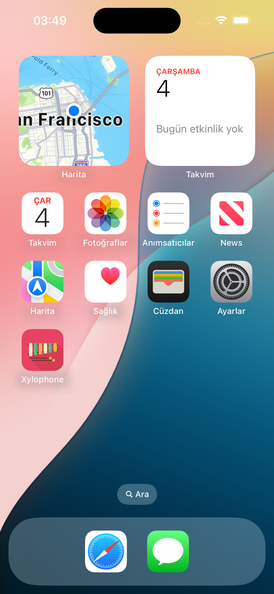
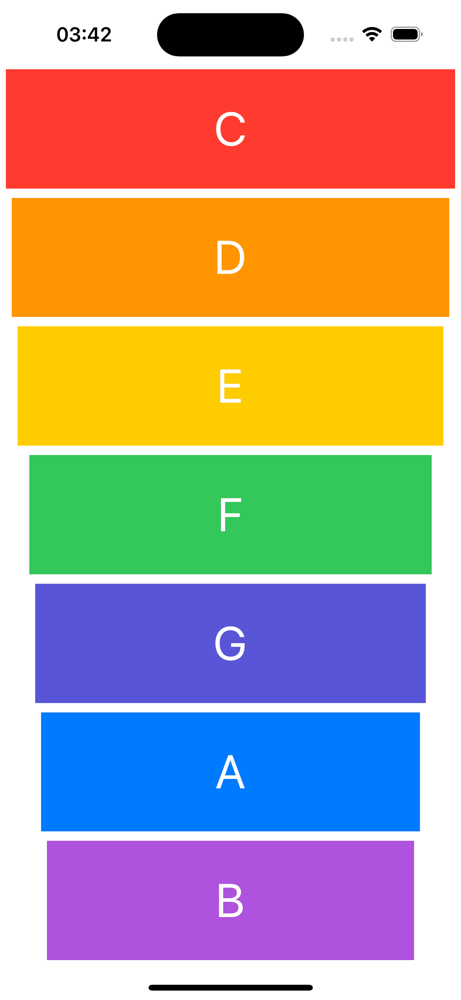
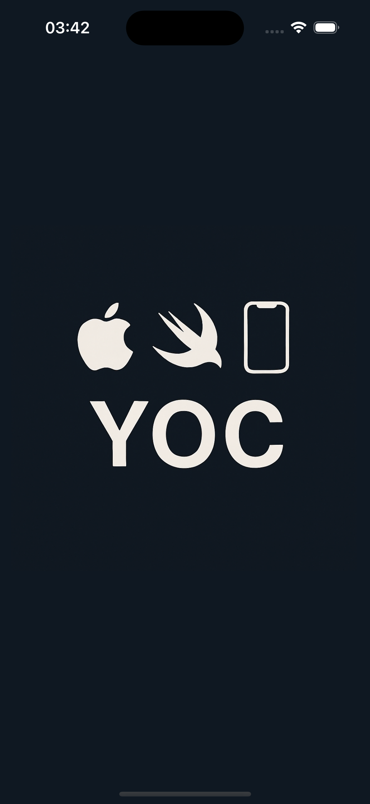

# Xylophone 🎶

**Xylophone** is a simple and colorful iOS app that plays musical notes when tapping on each key. It's built using SwiftUI and designed to be fun and intuitive for all ages.

### 🧙‍♀️ App Icon


## 📱 Features

- Play seven musical notes: C, D, E, F, G, A, B
- Each note has a unique vibrant color
- Smooth and minimal UI
- Built entirely with SwiftUI
- Compatible with iOS 16 and later

## 🖼️ Screenshots

### Main Screen



### 🔵 Splash Screen


## 🚀 Installation

To run the project locally:

1. Clone the repository:
   ```bash
   git clone https://github.com/Yoc0603/xylophone.git

## Author

**Yavuz** – iOS Developer
